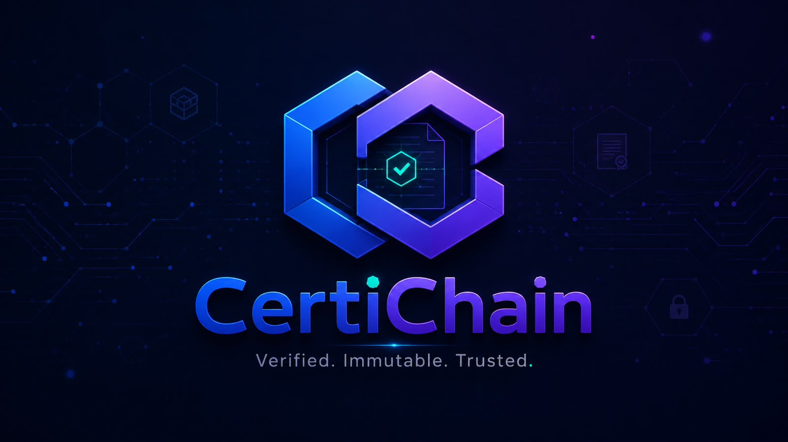

<p align="center">
  
</p>

<p align="center">
 
</p>


<p align="center">
 
  
  
  
</p>

<p align="center"><strong>Sistema de Certificados Académicos con Blockchain</strong></p>

<p align="center">Verificación inmutable, transparente y portable de credenciales académicas.</p>

---

## 📌 Descripción

**CertiChain** es una plataforma para emitir, proteger, administrar, compartir y verificar certificados académicos utilizando evidencia criptográfica y blockchain. Nació como proyecto final de **Fundamentos de Seguridad de Software (ISO-915)** en la Universidad APEC y evolucionó hacia una implementación profesional con portal institucional, aplicación móvil, API, smart contracts, persistencia SQL, almacenamiento cifrado e infraestructura Docker.

La arquitectura sigue un enfoque **off-chain first**: los datos personales y documentos completos permanecen fuera de una blockchain pública, mientras la cadena conserva únicamente la evidencia necesaria para demostrar autenticidad, integridad, emisor y estado.

## ✅ Estado actual

El desarrollo planificado de las **Fases 0–8 está implementado**. La base de código está preparada para staging y para un release `v1.0.0` una vez se conecten los servicios externos reales.

| Área | Estado |
|---|:---:|
| Smart contracts | ✅ |
| Backend / REST API | ✅ |
| Portal institucional | ✅ |
| Verificador público | ✅ |
| Aplicación móvil | ✅ |
| QR / cámara / wallet local | ✅ |
| PostgreSQL | ✅ |
| Cifrado AES-256-GCM | ✅ |
| Adaptador IPFS | ✅ |
| Docker / Docker Compose | ✅ |
| CI / CodeQL | ✅ |
| Métricas / readiness / logging | ✅ |
| Backup / restore | ✅ |
| Deploy automatizado del contrato | ✅ Preparado |
| Polygon/IPFS/DB administrados reales | ⏳ Requiere infraestructura externa |
| Auditoría independiente del smart contract | ⏳ Pre-mainnet |

> `main` no contiene claves privadas, tokens de infraestructura ni credenciales de producción. El go-live real requiere secretos externos y aprobaciones operativas.

---

## 🎓 Información académica

| Información | Detalle |
|---|---|
| 📖 Asignatura | **Fundamentos de Seguridad de Software (ISO-915)** |
| 👨‍🏫 Profesor | **Ing. Pedro José Ramirez Rodriguez** |
| 🏫 Institución | **Universidad APEC (UNAPEC)** |
| 📅 Período académico | **Septiembre - Diciembre 2025** |
| 🧩 Tipo | **Proyecto final / Aplicación móvil con Blockchain** |

### 👥 Equipo académico original

| Integrante | Matrícula |
|---|---|
| 👨🏻‍💻 **Francis Jairo Matías Rosario** | **A00115261** |
| 👩🏻‍💻 **Pieranyela José Carrasco Rodríguez** | **A00116415** |
| 👨🏻‍💻 **Jenrry Monegro Rosario** | **A00116621** |
| 👨🏻‍💻 **Enmanuel Alberto Arias de Jesus** | **A00117358** |

## 🧭 Continuidad académica

CertiChain ocupa un punto intermedio dentro de varias relaciones académicas verificables de la trayectoria en UNAPEC. Estas relaciones se documentan por separado para distinguir la recurrencia de estudiantes, la continuidad docente y el cruce institucional ITLA → UNAPEC.

### 👥 Continuidad por estudiantes

**Pieranyela José Carrasco Rodríguez (A00116415)** y **Jenrry Monegro Rosario (A00116621)** coincidieron con Francis Jairo Matías Rosario en dos asignaturas distintas durante **Septiembre - Diciembre de 2025**: **CertiChain (ISO-915)** y [**AccessiUX Market**](https://github.com/Jairo0811/AccessiUX-Market), originado en **Ingeniería de la Usabilidad (ISO-505)**. Posteriormente, ambos volvieron a coincidir con Francis en [**CineGest**](https://github.com/Jairo0811/CineGest), correspondiente a **Desarrollo de Software con Tecnología Open Source I (ISO-610)** durante **Enero - Abril de 2026**.

| Orden | Asignatura | Proyecto | Período |
|---:|---|---|---|
| 1 | Fundamentos de Seguridad de Software (ISO-915) | **CertiChain** | Septiembre - Diciembre 2025 |
| 2 | Ingeniería de la Usabilidad (ISO-505) | [**AccessiUX Market**](https://github.com/Jairo0811/AccessiUX-Market) | Septiembre - Diciembre 2025 |
| 3 | Desarrollo de Software con Tecnología Open Source I (ISO-610) | [**CineGest**](https://github.com/Jairo0811/CineGest) | Enero - Abril 2026 |

La recurrencia queda respaldada por el mismo **nombre completo y matrícula** en los equipos académicos de los tres proyectos. La relación es formativa y cronológica; no implica dependencia técnica entre las aplicaciones.

### 👨‍🏫 Continuidad por profesor

El profesor **Ing. Pedro José Ramirez Rodriguez** aparece en una secuencia formativa de tres proyectos independientes: [**NutriFlow**](https://github.com/Jairo0811/NutriFlow), CertiChain y [**Digital Sanctuary**](https://github.com/Jairo0811/DigitalSanctuary).

| Orden | Asignatura | Proyecto | Período |
|---:|---|---|---|
| 1 | Bases de Datos 1 (INF-164) | [**NutriFlow**](https://github.com/Jairo0811/NutriFlow) | Mayo - Agosto 2024 |
| 2 | Fundamentos de Seguridad de Software (ISO-915) | **CertiChain** | Septiembre - Diciembre 2025 |
| 3 | Desarrollo de Software con Tecnología Propietaria 2 (ISO-710) | [**Digital Sanctuary**](https://github.com/Jairo0811/DigitalSanctuary) | Mayo - Agosto 2026 |

La secuencia es **formativa y cronológica**: comienza con fundamentos de datos y modelado, continúa con seguridad de software y blockchain, y posteriormente llega al desarrollo de una aplicación Android nativa. Los proyectos no constituyen versiones ni dependencias técnicas entre sí.

### 🏫 Cruce institucional ITLA → UNAPEC

Dentro del equipo de CertiChain existen trayectorias previas documentadas en el **Instituto Tecnológico de Las Américas (ITLA)** antes de coincidir en UNAPEC:

| Integrante | Matrícula UNAPEC | Matrícula ITLA |
|---|---|---|
| Francis Jairo Matías Rosario | A00115261 | 2015-2984 |
| Pieranyela José Carrasco Rodríguez | A00116415 | 2019-8767 |
| Jenrry Monegro Rosario | A00116621 | 2019-8690 |
| Enmanuel Alberto Arias de Jesus | A00117358 | 2019-7415 |

El cruce institucional documenta la trayectoria educativa previa de los cuatro integrantes del equipo. Para Pieranyela y Jenrry, la continuidad posterior en UNAPEC queda además documentada en **AccessiUX Market** y **CineGest**. No implica que hayan cursado juntos una misma asignatura en ITLA.

CertiChain forma parte de la evolución académica y técnica de proyectos preservados y modernizados posteriormente con prácticas de ingeniería de software.

---

## ✨ Funcionalidades

### Portal institucional

- autenticación administrativa;
- dashboard con métricas, actividad reciente y estados;
- emisión de certificados;
- listado, búsqueda, filtrado y paginación;
- detalle y revocación de credenciales;
- verificación pública por ID + SHA-256;
- diseño responsive alineado con el sistema visual de CertiChain.

### Aplicación móvil

- wallet local de credenciales verificadas;
- navegación Inicio / Escanear / Historial / Perfil;
- generación y lectura de QR;
- escáner real mediante cámara;
- detalle de credenciales;
- copia y compartición de identificadores;
- historial protegido mediante `expo-secure-store`.

### Backend

- Node.js + Express + TypeScript;
- JWT y RBAC;
- emisión, revocación, verificación y auditoría;
- validación mediante Zod;
- rate limiting y headers defensivos;
- PostgreSQL en entornos con `DATABASE_URL`;
- fallback JSON únicamente para desarrollo/test;
- `POST /api/documents` para cifrar y almacenar certificados;
- `/health`, `/ready` y `/metrics`.

### Blockchain

- `CertificateRegistry.sol`;
- instituciones/emisores autorizados;
- emisión y revocación;
- consulta y verificación de hashes;
- eventos para trazabilidad;
- Hardhat + OpenZeppelin;
- redes Sepolia, Polygon Amoy y Polygon PoS.

---

## 🏗️ Arquitectura

```text
┌─────────────────────────────────────────────────────────────┐
│                         Clientes                            │
│                                                             │
│  📱 Mobile App        🖥️ Portal Institucional   🔍 Verifier │
└───────────────┬─────────────────────┬───────────────────────┘
                │                     │
                └──────────┬──────────┘
                           ▼
                 ┌───────────────────┐
                 │    REST API       │
                 │ Node.js / TS      │
                 └─────────┬─────────┘
                           │
             ┌─────────────┼─────────────┐
             ▼             ▼             ▼
        PostgreSQL     Encrypted       Blockchain
                       Storage/IPFS     Gateway
                           │             │
                           │             ▼
                           │        CertificateRegistry
                           │        Solidity / Polygon
                           └─────────────┬─────────────
                                         ▼
                                  Audit / Metrics
```

### Datos on-chain

- identificador criptográfico;
- hash del documento;
- emisor;
- estado;
- timestamps;
- referencia no sensible.

### Datos off-chain

- nombre del estudiante;
- documentos académicos;
- PDF completo;
- información privada institucional;
- secretos y claves.

---

## 🧱 Stack tecnológico

### 📱 Mobile y Web

<p>
  
  
</p>

### ⚙️ Backend y API

<p>
  
  
  
</p>

### 🗄️ Datos, Blockchain y Storage

<p>
  
  
  
  
</p>

### 🧪 Testing, Seguridad y DevOps

<p>
  
  
  
  
</p>

| Capa | Tecnologías |
|---|---|
| Mobile | React Native, Expo, TypeScript, Expo Camera, Secure Store |
| Web | React, TypeScript, Vite |
| API | Node.js, Express, TypeScript, Zod, JWT |
| Persistencia | PostgreSQL; JSON solo como fallback local/test |
| Blockchain | Solidity, Hardhat, OpenZeppelin, Ethers.js |
| Redes | Sepolia, Polygon Amoy, Polygon PoS |
| Storage | AES-256-GCM + IPFS |
| Testing | Vitest, Supertest, Hardhat Test |
| DevOps | Docker, Docker Compose, GitHub Actions, GHCR |
| Seguridad | CodeQL, RBAC, SHA-256, rate limiting, auditoría |
| Observabilidad | Prometheus metrics, readiness, structured logs |

---

## 🚀 Ejecución local con Docker

### Requisitos

- Docker Desktop / Docker Engine;
- Docker Compose;
- Git.

### 1. Configuración

```bash
cp .env.example .env
```

Para una prueba local, cambia al menos:

```env
JWT_SECRET=replace-this-with-a-long-local-secret
ADMIN_PASSWORD=CertiChain2026!Local
CORS_ORIGIN=http://localhost:8080
VITE_API_URL=http://localhost:4000
```

### 2. Levantar el stack

```bash
docker compose up -d --build
```

Se levantan:

- PostgreSQL;
- API: `http://localhost:4000`;
- Web: `http://localhost:8080`.

### 3. Verificación

```bash
curl http://localhost:4000/health
curl http://localhost:4000/ready
```

El healthcheck de Docker utiliza `/ready`, por lo que el portal web espera a que la persistencia esté disponible.

### Desarrollo sin blockchain

Blockchain puede permanecer sin configurar durante pruebas locales. En ese modo, los certificados se almacenan off-chain con estado `pending`. Para staging/producción, la configuración de blockchain es obligatoria.

---

## 🔐 Documentos cifrados e IPFS

La API calcula **SHA-256 sobre el documento original** y posteriormente lo cifra con **AES-256-GCM**. Solo el contenido cifrado se escribe en storage/IPFS.

En desarrollo:

```env
STORAGE_DRIVER=local
```

En producción:

```env
STORAGE_DRIVER=ipfs
DOCUMENT_ENCRYPTION_KEY=<64 caracteres hexadecimales>
IPFS_API_URL=https://...
IPFS_API_TOKEN=...
```

`NODE_ENV=production` no inicia si falta la llave de cifrado o si el storage no es IPFS.

---

## 🗄️ PostgreSQL y recuperación

Con `DATABASE_URL`, la API utiliza PostgreSQL y crea las tablas/índices requeridos de manera idempotente.

Scripts operativos:

```bash
scripts/backup-postgres.sh
ALLOW_RESTORE=YES scripts/restore-postgres.sh backups/certichain-<timestamp>.dump
```

Los backups generan checksum SHA-256 y el restore requiere confirmación explícita mediante `ALLOW_RESTORE=YES`.

---

## ⛓️ Despliegue de smart contracts

El workflow **Deploy CertificateRegistry** se ejecuta manualmente desde GitHub Actions y permite seleccionar:

- `sepolia`;
- `amoy`;
- `polygon`.

Los RPC y `BLOCKCHAIN_PRIVATE_KEY` deben estar configurados como secretos del environment correspondiente. Nunca se almacenan en el repositorio.

---

## 📊 Observabilidad

Endpoints:

```text
GET /health
GET /ready
GET /metrics
```

En producción, `/metrics` exige `METRICS_TOKEN`. Las solicitudes generan logs JSON con request ID, método, ruta, estado y duración.

---

## 🧪 Quality gates

Cada cambio debe superar:

```text
format
lint
type-check
tests
build
CodeQL
```

Los tests de API incluyen el ciclo:

```text
autenticación → emisión → listado → revocación → verificación
```

Los smart contracts cuentan con pruebas de permisos, emisión, revocación e integridad.

---

## 🗺️ Roadmap

| Fase | Alcance | Estado |
|---|---|:---:|
| 0 | Fundación, documentación y arquitectura | ✅ |
| 1 | Blockchain Core | ✅ |
| 2 | Backend API | ✅ |
| 3 | Portal institucional | ✅ |
| 4 | Aplicación móvil | ✅ |
| 5 | Verificación pública | ✅ |
| 6 | Seguridad, privacidad y storage | ✅ |
| 7 | Testing, DevOps y despliegue | ✅ |
| 8 | Producción y expansión | ✅ Base implementada |

### Operaciones de go-live

El código está preparado, pero los siguientes pasos dependen de servicios/credenciales externos:

- PostgreSQL administrado;
- proveedor IPFS;
- RPC de Polygon;
- wallet de despliegue;
- dominio HTTPS + CDN/WAF;
- plataforma de observabilidad;
- auditoría independiente del smart contract;
- pruebas E2E sobre staging real;
- creación final del tag `v1.0.0`.

Consulta [`docs/production-readiness.md`](docs/production-readiness.md) para el checklist detallado.

---

## 🔒 Seguridad

- ningún secreto debe almacenarse en Git;
- producción exige configuración fuerte y completa;
- PII permanece off-chain;
- documentos se cifran antes de storage/IPFS;
- wallets de despliegue deben utilizar mínimo privilegio y fondos limitados;
- secretos de staging y producción nunca se reutilizan;
- antes de Polygon Mainnet se requiere revisión independiente del smart contract.

Consulta [`SECURITY.md`](SECURITY.md) para el proceso de reporte de vulnerabilidades.

---

## 📄 Licencia

MIT. Consulta [`LICENSE`](LICENSE).

---

## 👨‍💻 Mantenimiento

**Francis Jairo Matías Rosario**  
Matrícula: **A00115261**  
Ingeniería de Software  
Universidad APEC (UNAPEC)

---

<p align="center"><strong>CertiChain — Verify once. Trust anywhere.</strong></p>
